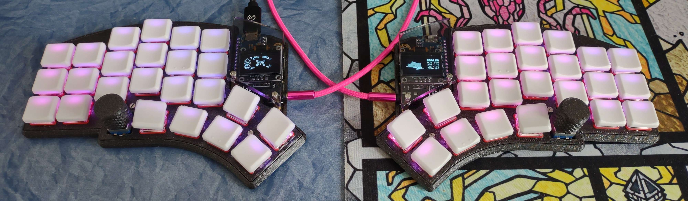
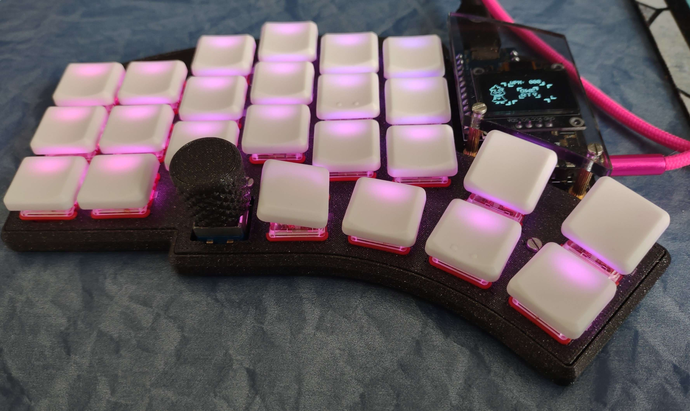
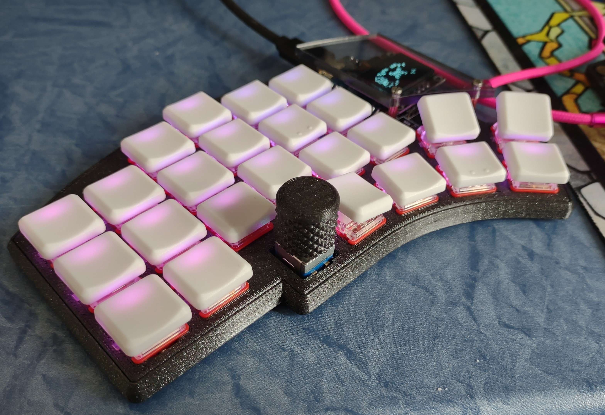
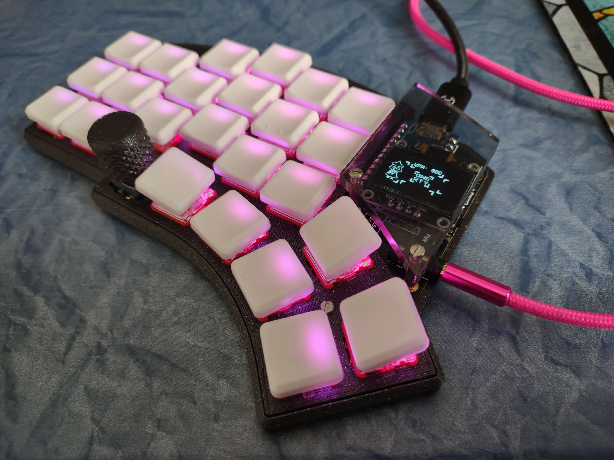
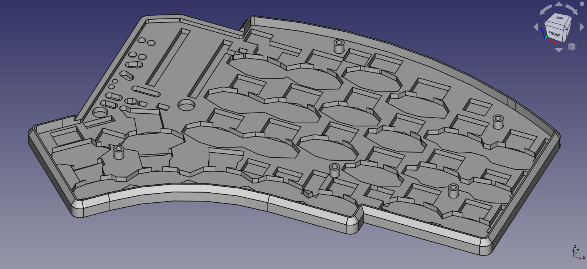
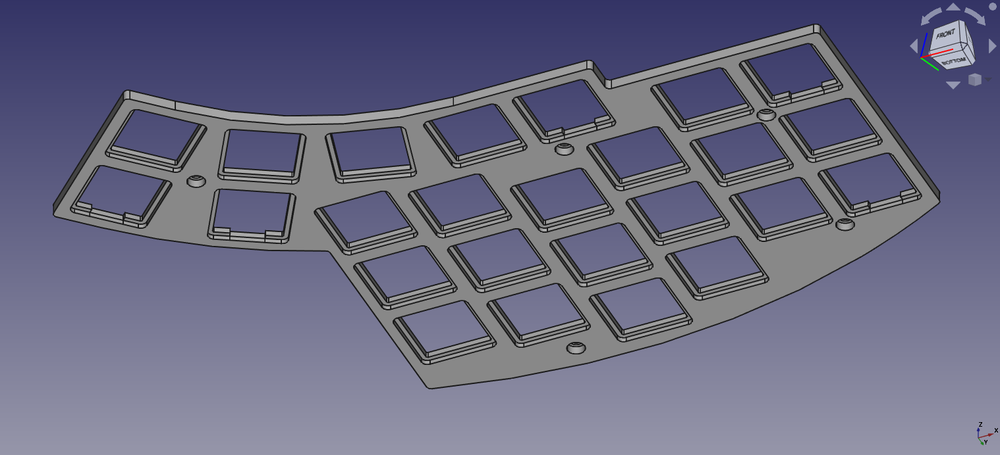

# Kyria Case for 3D printers

Heyo! This is my attempt at modelling a case for [splitkb's Kyria rev3](https://splitkb.com/collections/keyboard-kits/products/kyria-rev3-pcb-kit). It makes heavy use of the [official case files](https://github.com/splitkb/kyria), so this project also uses the Creative Commons BY-NC-SA License.

The special part of this case is that both the top and the bottom plate rest against the PCB, which makes inserting switches into the plate and PCB much easier, and (in my opinion) greatly improves the keyboard's acoustics.

The case is modelled in FreeCAD, to make sure everyone can view and edit the case to their liking. For example, just by adjusting a few values in the "data" spreadsheet, the top plate can be adjusted for MX switches rather than choc switches.

Note, this case only consists of a bottom and a top plate. For encoder knobs and oled covers you'll have to look somewhere else.

## Compatibility

This case is compatible with the choc hotswap/solder version of the kyria, as well as the MX solder version after adjusting some values in the "data" spreadsheet. I can't vouch for compatibility with the MX hotswap version however, the component pockets might have to be adjusted for those.

## Printing

Personally, I recommend PLA for an easy time, and a 0.1mm layer height for the bottom plate for added strength for the modelled-in standoffs. I'm using Prusa Slicer, and here are the changes I made to the default 0.1mm DETAIL profile:

 - Bottom fill pattern            -> Monotonic Lines
 - Fill density                   -> 100%
 - Fill pattern                   -> Rectilinear
 - Bottom solid layers            -> 1
 - Minimum bottom shell thickness -> 0.1
 - Top solid layers               -> 1
 - Minimum top shell thickness    -> 0.1
 - Seam position                  -> Random

Be sure to flip the top plate around! The top of the top plate should be on the build plate of your printer.

## Pictures

